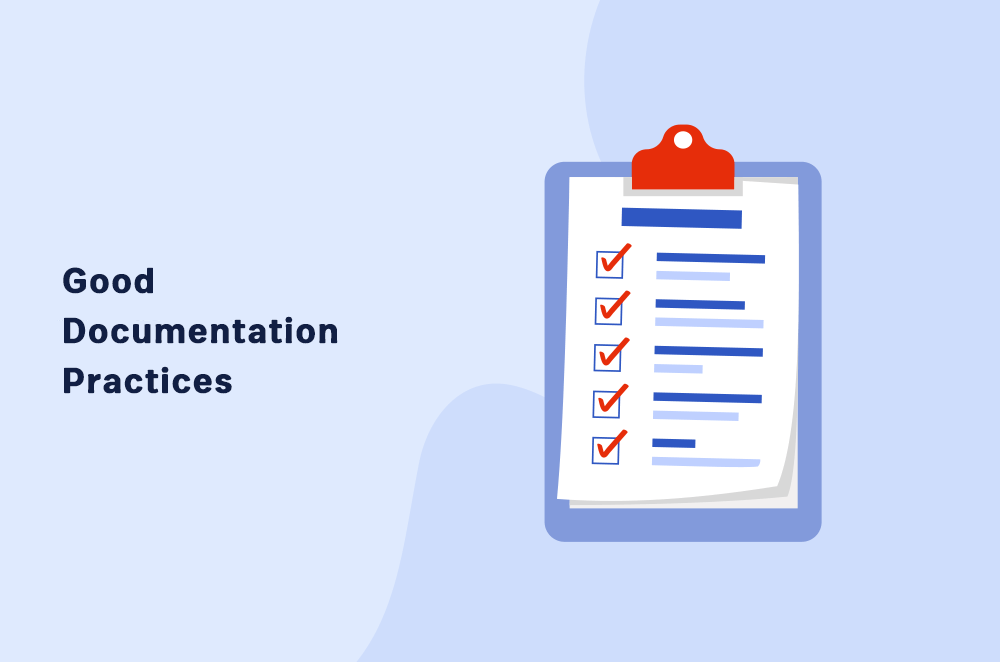

# TheRepository

## First time trying github 
For testing 

A hands-on repository demonstrating **GitHub** documentation best practices

*Created for the "Mastering GitHub Documentation" workshop*

# LICENSE

This project is licensed under the MIT License - see the  for more details 
